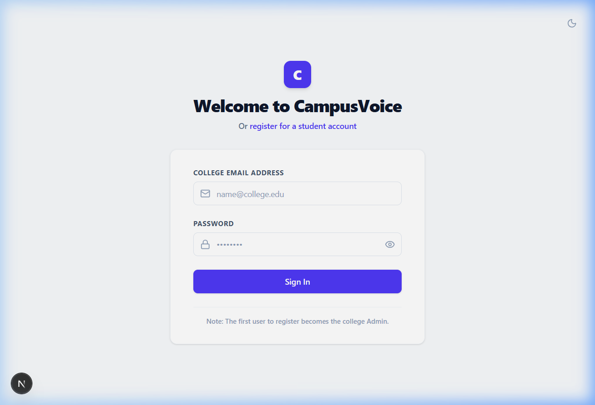
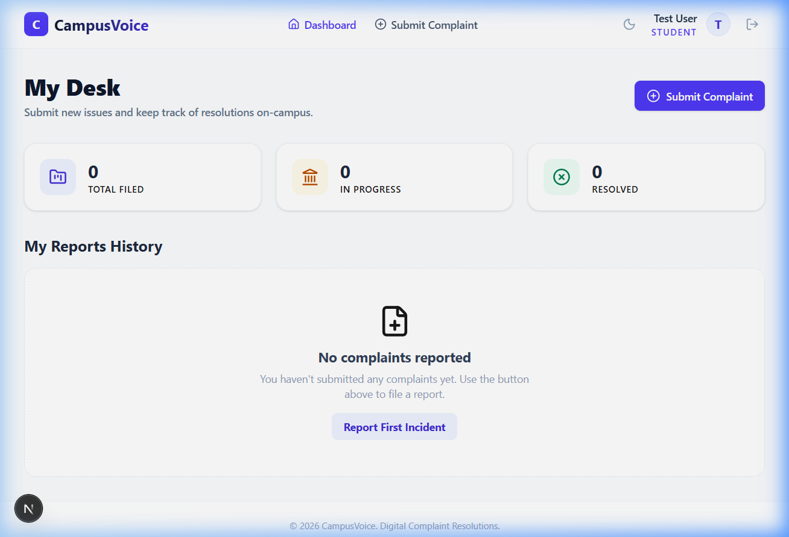

# CampusVoice — Student Complaint Management System

## Problem Statement

Colleges often rely on manual, informal channels — paper forms, WhatsApp groups, or word-of-mouth — to handle student complaints about campus facilities like classrooms, hostels, Wi-Fi, cleanliness, and transportation. This makes it hard for students to track progress and for administrators to prioritize, assign, and resolve issues efficiently. 

**CampusVoice** replaces this manual process with a centralized digital platform where students can submit complaints with evidence, track their status in real time, and administrators can review, assign, prioritize, and resolve issues — all with a full audit trail.

---

## Features

### Core Features
- Student registration and login with JWT-based authentication.
- Complaint submission with category, location, detailed description, and file/image attachment.
- Complaint status tracking: `Submitted` ➔ `Under Review` ➔ `Assigned` ➔ `In Progress` ➔ `Resolved` ➔ `Closed`.
- Student dashboard showing complaint history and current status.
- Admin console to view, search, and filter all complaints.
- Department/staff workload assignment for each complaint.
- Priority levels: `Low` / `Medium` / `High` / `Critical`.
- Admin comments and resolution details.
- Full CRUD API for complaints management.
- Basic complaint statistics aggregations (total filed, in progress, resolved).

### Bonus Features
- Role-based access control (Student / Admin / Staff).
- Responsive, clean operator-console UI with Light/Dark mode switcher.
- Search and filter by status, category, and priority.
- Local file upload support for complaint attachments.

---

## Technology Stack

| Layer | Technologies |
| :--- | :--- |
| **Frontend** | Next.js, React, Tailwind CSS, Axios, Zustand |
| **Backend** | Node.js, Express.js |
| **Database** | MongoDB (MongoDB Atlas) |
| **Authentication** | JSON Web Tokens (JWT), bcrypt for password hashing |
| **File Uploads** | Multer (local storage; Cloudinary-ready) |
| **Deployment** | Vercel (frontend), Render (backend), MongoDB Atlas (database) |

---

## Screenshots

### Login Page


### Student Dashboard


---

## Live Demo

- **Frontend (Vercel):** [https://student-complaint-management-system-delta.vercel.app](https://student-complaint-management-system-delta.vercel.app)
- **Backend API (Render):** [https://student-complaint-management-system-0bca.onrender.com](https://student-complaint-management-system-0bca.onrender.com)

> [!NOTE]
> The backend is hosted on Render's free tier, which spins down after periods of inactivity. The first request after idle time may take 30–60 seconds to respond.

---

## Setup Instructions

To run this project locally:

### 1. Clone the repository
```bash
git clone https://github.com/aashritha203/student-complaint-management-system.git
cd student-complaint-management-system
```

### 2. Install backend dependencies
```bash
cd server
npm install
```

### 3. Install frontend dependencies
```bash
cd ../client
npm install
```

### 4. Configure Environment Variables
Create a local config `.env` inside `server/` and a `.env.local` inside `client/` (see the Keys list below).

### 5. Run the Backend
```bash
cd server
npm run dev
```
*Server runs at `http://localhost:5000`*

### 6. Run the Frontend
In a separate terminal process window:
```bash
cd client
npm run dev
```
*Frontend runs at `http://localhost:3000`*

---

## Environment Variables

### Backend (`server/.env`)
- `PORT` - Local server port (default `5000`)
- `MONGO_URI` - MongoDB connection cluster string
- `JWT_SECRET` - Key to sign web tokens
- `CLOUDINARY_CLOUD_NAME` - Cloudinary cloud credential name
- `CLOUDINARY_API_KEY` - Cloudinary API credential key
- `CLOUDINARY_API_SECRET` - Cloudinary API credential secret
- `FRONTEND_URL` - Production Vercel web URL whitelist for CORS

### Frontend (`client/.env.local`)
- `NEXT_PUBLIC_API_URL` - Render API service URL
